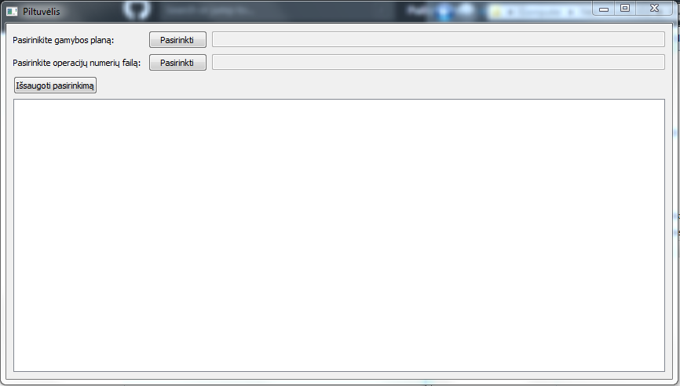
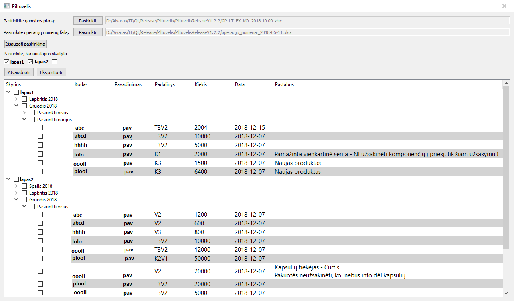

# Piltuvelis
Program for forming an import file for "Rivilė" accounting system from excel file.

Compiled with Qt 5.10.0 MinGW 32bit

# Description 
Required files(not present in the repository):
- Excel file with the production plan
- Excel file with identification ids

When a new order for a product is created firstly its documented in an excel file. To upload it to the database each order has to be entered separately so to make it more convenient the program searches through the excel file and finds new orders and displays them in a tree hierarchy. The user can then select which orders to export to .eip file and import it to the database.

### Visualization is with dummy data

